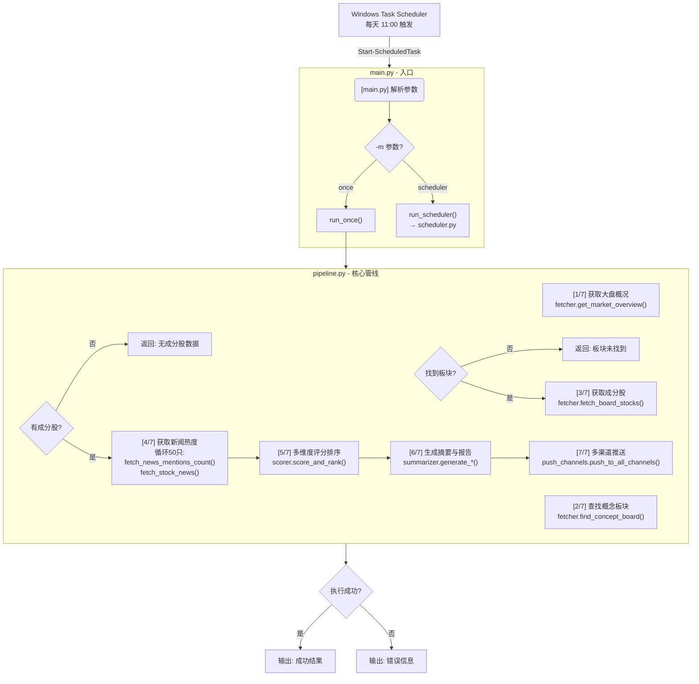
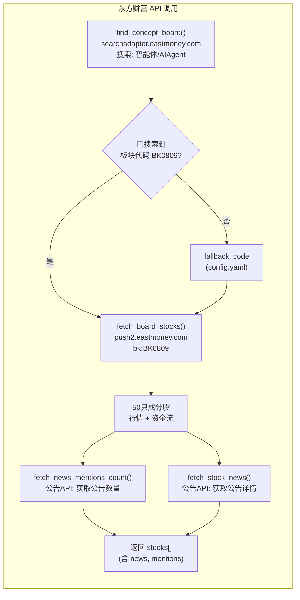
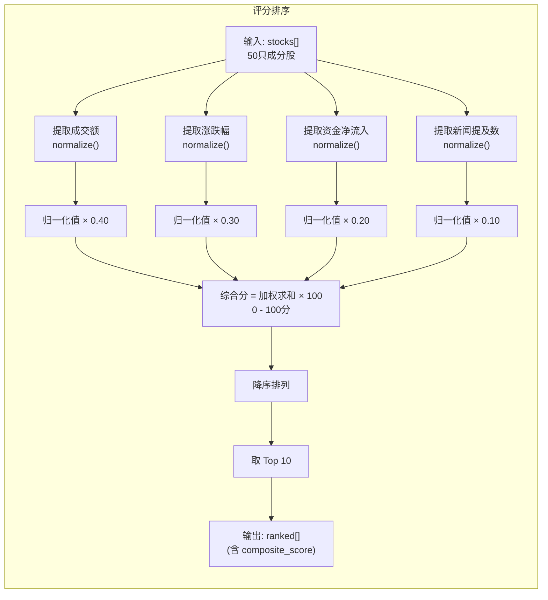
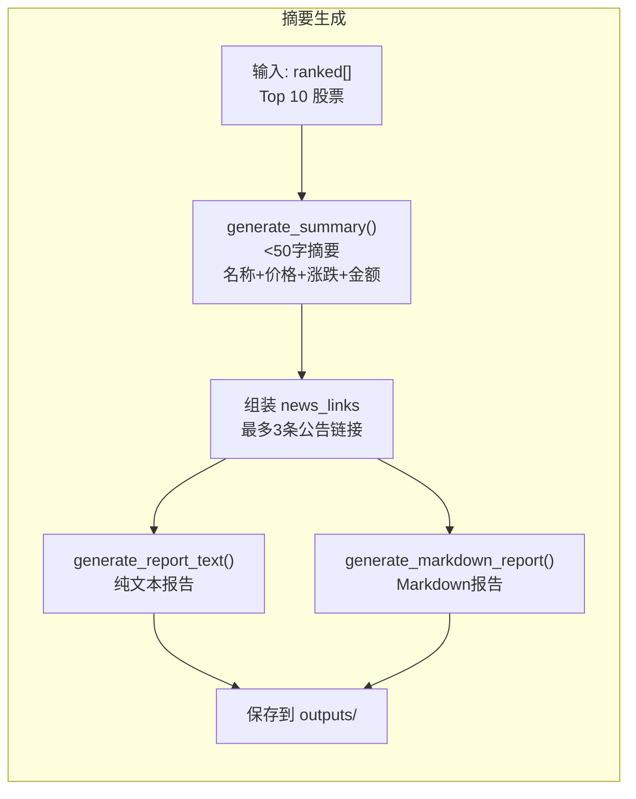
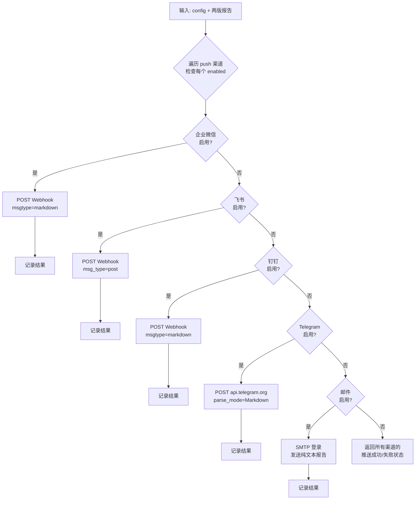
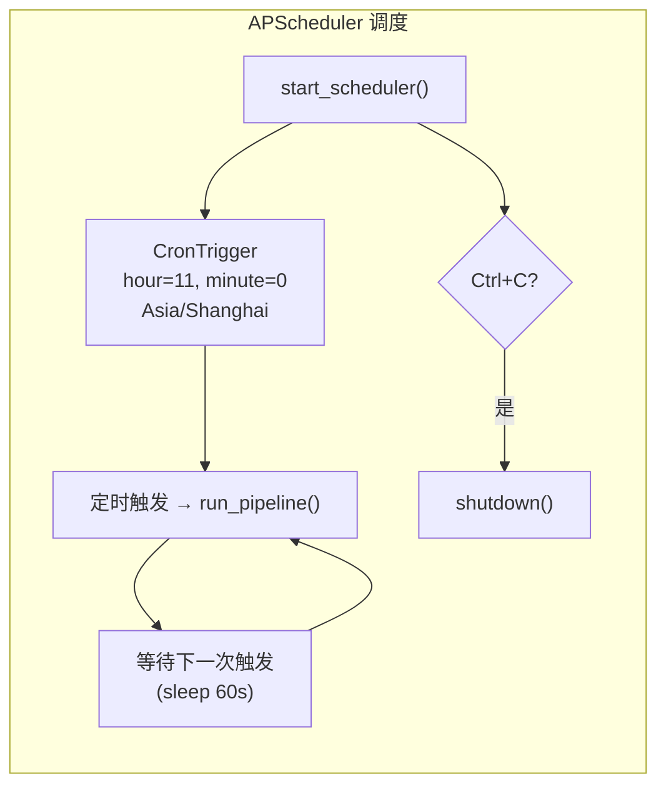
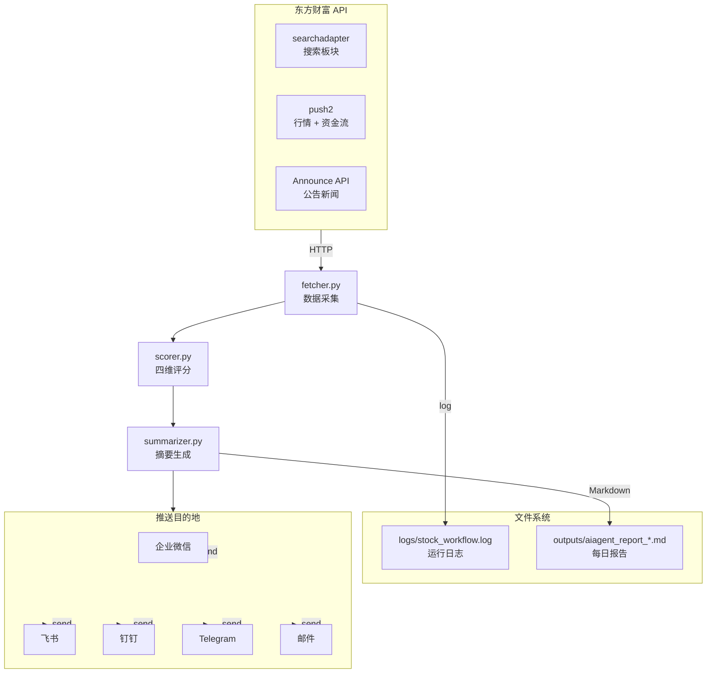
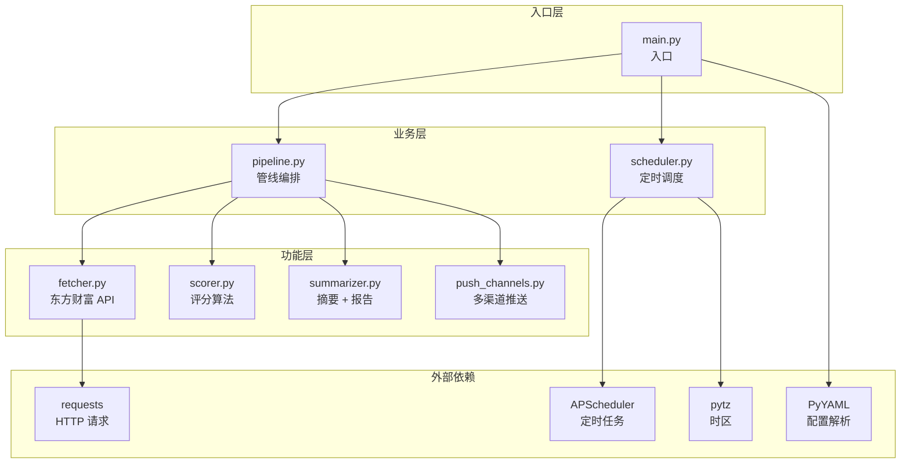
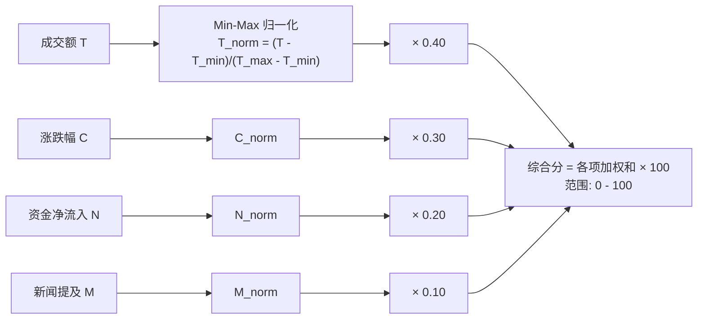

# 脚本代码流程图

## 1. 整体架构流

## 2. 数据获取模块 (fetcher.py)

## 3. 评分排序模块 (scorer.py)

## 4. 摘要与报告生成 (summarizer.py)

## 5. 推送模块 (push_channels.py)

## 6. 调度模块 (scheduler.py)

## 完整数据流

## 模块依赖图

## 评分公式

